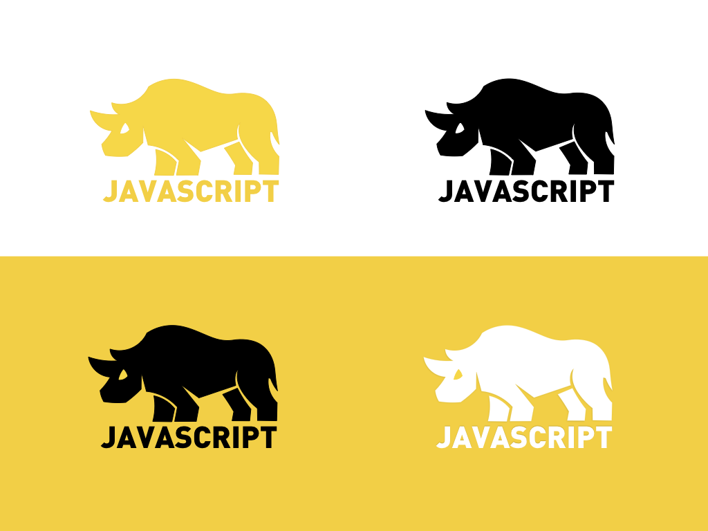

# Rhino Icon

I drawed a rhino icons using a keynote. If you want to redraw and change a bit. Download [Rhino.key](https://github.com/rhiokim/rhino-icon/blob/master/Rhino.key?raw=true)

## TODO

* [ ] png with transparent background
* [ ] various size
* [ ] black background version

## License

MIT
